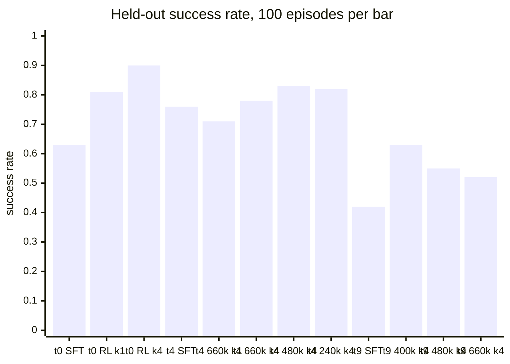

# Single-task DICE-RL on LingBot-VA: held-out results

Protocol: LIBERO-10, one task per run, 100 evaluation episodes per policy = the 50 canonical init states × 2 seeds (`EvalConfig(stage="heldout")`, seed 42). Identical states and seeds for every policy on a task. SFT prior = `libero30-sft` step 600 with best-of-1. RL = frozen prior + residual actor, best-of-4 by critic argmax (the method) or best-of-1 (residual only). 95% intervals are ±0.06–0.10 at n=100. Source: `result/heldout/summary.csv` and the per-episode JSON under `result/heldout/<policy>/task_XX/`.

## Results

| task | policy | successes | rate | mean steps | vs SFT paired: gained / lost | states 2/2 · 1/2 · 0/2 |
|---|---|---|---|---|---|---|
| 0 | SFT, best-of-1 | 63 | 0.63 | 389 | — | 21 · 21 · 8 |
| 0 | RL 660k, best-of-1 | 81 | 0.81 | 355 | 26 / 8 | 32 · 17 · 1 |
| 0 | RL 660k, best-of-4 | 90 | 0.90 | 335 | 34 / 7 | 40 · 10 · 0 |
| 4 | SFT, best-of-1 | 76 | 0.76 | 317 | — | 29 · 18 · 3 |
| 4 | RL 660k, best-of-1 | 71 | 0.71 | 325 | 8 / 13 | 28 · 15 · 7 |
| 4 | RL 660k, best-of-4 | 78 | 0.78 | 300 | 12 / 10 | 32 · 14 · 4 |
| 4 | RL 480k, best-of-4 | 83 | 0.83 | 294 | 15 / 8 | 36 · 11 · 3 |
| 4 | RL 240k, best-of-4 | 82 | 0.82 | 290 | 16 / 10 | 36 · 10 · 4 |
| 9 | SFT, best-of-1 | 42 | 0.42 | 437 | — | 13 · 16 · 21 |
| 9 | RL 400k, best-of-4 | 63 | 0.63 | 382 | 33 / 12 | 20 · 23 · 7 |
| 9 | RL 480k, best-of-4 | 55 | 0.55 | 401 | 32 / 19 | 17 · 21 · 12 |
| 9 | RL 660k, best-of-4 | 52 | 0.52 | 404 | 27 / 17 | 15 · 22 · 13 |

"Gained / lost" pairs each RL episode with the SFT episode on the same init state and seed. "States 2/2 · 1/2 · 0/2" counts init states succeeded on both seeds, one seed, neither. Every failure on every policy is a truncation at 520 steps; no policy fails by termination.

## Training runs

Identical recipe (`docs`: README, "DICE-RL residual training"), 660k env steps, one L40S each. Values below are means over 110k-env-step bins of the logged update metrics (10 gradient steps per 4 chunks) or over collection episodes.

| metric | task 0: 0k → 550k+ | task 4: 0k → 550k+ | task 9: 0k → 550k+ |
|---|---|---|---|
| collection success (procedural resets, best-of-4 after 64k) | 0.75 → 0.87 | 0.76 → 0.87 | 0.46 → 0.67 (400k) → 0.48 (640k) |
| train-eval, 10 procedural episodes (0 / 80k / 240k / 400k / 560k) | 6 / 7 / 9 / 8 / 9 | 6 / 6 / 10 / 9 / 9 | 4 / 8 / 5 / 6 / 3 |
| train-eval ΔV at 80k / 240k / 400k / 560k | 0.006 / 0.060 / 0.021 / 0.071 | 0.001 / 0.007 / 0.001 / 0.003 | 0.001 / 0.024 / 0.017 / 0.004 |
| better_than_base_rate | 0.72 → 0.87 | 0.73 → 0.88 | 0.63 → 0.88 |
| q_advantage | 0.017 → 0.040 | 0.018 → 0.064 | 0.019 → 0.102 |
| q_overestimation_online | +0.136 → −0.028 | +0.146 → +0.049 | +0.148 → −0.027 |
| q_overestimation (all rows) | 0.000 → −0.028 | 0.011 → +0.042 | +0.011 → −0.028 |
| residual_rms | 0.010 → 0.015 | 0.011 → 0.018 | 0.012 → 0.027 |
| actor_grad_norm | 0.20 → 0.22 | 0.19 → 0.33 | 0.35 → 0.72 |
| critic_loss | 0.019 → 0.018 (min 0.011 at 220k) | 0.019 → 0.018 (min 0.013 at 220k) | 0.031 → 0.028 (min 0.019 at 200k) |
| bc_filter_rate | ≥ 0.9994 | ≥ 0.9987 | ≥ 0.995 |

Metric definitions, from `script/lingbot_rl_model.py` and `script/lingbot_rl_train.py`:

- `better_than_base_rate`: fraction of (replay row, stored candidate) pairs with Q(s, a_base + residual) > Q(s, a_base), Q = min over the 10 critics. Computed on training-buffer states with the same critic the actor is optimised against.
- `q_advantage`: batch mean of Q(s, a_base + residual) − Q(s, a_base), same critic and states.
- `q_overestimation`: batch mean of Q(s, a_stored) − Monte-Carlo return, where a_stored is the action executed at collection time, not the actor's current output. `_online` restricts to online rows.
- `train-eval ΔV`: mean of Q(s, a_base + residual) − Q(s, a_base) over 8 fresh prior samples at one procedural reset state (`env.reset(seed=0)`), so a single-state measurement outside the replay buffer.
- `residual_rms`: RMS of the residual over the 7 live action channels × 16 steps, normalised action units.

## Task 9: gain at 400k, decline afterwards

Facts:

1. Held-out best-of-4: 63 at 400k, 55 at 480k, 52 at 660k, against SFT 42. Episodes gained versus SFT stayed at 27–33 across the three checkpoints; episodes lost rose from 12 to 17–19.
2. Collection success rose from 0.46 (first bin) to 0.67 at 400k and fell to 0.48 by 640k; mean episode length went 420 → 374 → 407 over the same range.
3. Train-eval ΔV was 0.024 at 240k, 0.017 at 400k and 0.004 at 560k; train-evals were 4 / 8 / 5 / 6 / 3 of 10.
4. From 400k to 640k: online overestimation went from +0.048 to −0.027 (critic Q on executed actions dropped below the Monte-Carlo return), the critic-predicted advantage of the actor's corrections held at 0.095–0.103, actor gradient norm rose 0.53 → 0.72, critic gradient norm 0.67 → 0.90, critic loss 0.020 → 0.028, residual RMS stayed at 0.026–0.027.
5. Task 9's residual (0.027) and actor gradient norm (0.72) are the largest of the three runs; its critic-predicted advantage (0.10) is the highest.

Conclusions that follow:

- The run's best measured policy is the 400k checkpoint; checkpoints after it lose more SFT successes than they gain. Selecting the final checkpoint would have reported +10 instead of +21.
- The decline coincides with the critic turning pessimistic on executed actions while rating the actor's unexecuted corrections ever higher, and with rising actor and critic gradients against a fixed-size residual. This is the task-4 pattern (its facts 2–4) arriving late, after a period in which the residual transferred.
- Across the three runs, the train-eval ΔV ordering at 240k–400k (task 0 > task 9 > task 4) matches the held-out gain ordering; `better_than_base_rate` and `q_advantage` do not.

Not established: the 240k checkpoint's held-out rate (ΔV peaked there); the best-of-1 rate at 400k.

## Task 4: why a high better-than-base rate did not carry to the held-out eval

Facts:

1. `better_than_base_rate` (0.88) and `q_advantage` (0.064) are the critic's assessment of the actor's outputs on buffer states, produced by the critic the actor maximises. Neither uses environment returns. Task 0 reached comparable values (0.87, 0.040) and its residual-only held-out gain was +18; task 4's was −5. Across the two runs these metrics do not predict realised gain.
2. The only logged quantity that compares the critic to realised returns, `q_overestimation`, is evaluated on the executed action a_stored, not on a_base + residual. It therefore cannot detect a critic that overrates the actor's residual specifically. On task 4 it stayed positive on online rows for the whole run (+0.146 → +0.049), whereas on task 0 it crossed to negative after 330k (−0.028 at the end).
3. Outside the buffer, the critic's predicted advantage for task 4 is near zero: train-eval ΔV was 0.001–0.007 at every checkpoint (task 0: 0.021–0.071), against a buffer-state `q_advantage` of 0.064. The task-4 advantage the critic reports is concentrated on replayed states.
4. Task 4's residual is larger than task 0's (RMS 0.018 vs 0.015) and its actor gradient norm grew through the run (0.19 → 0.33) while task 0's stayed flat (0.20 → 0.22).
5. Held-out best-of-1 at 660k loses 13 SFT successes and gains 8, and the number of init states failing on both seeds rises from 3 (SFT) to 7. Best-of-4 recovers to 12 gained / 10 lost. The 240k and 480k checkpoints, best-of-4, are the only task-4 policies above the prior by more than their interval's half-width (82, 83 vs 76; ±0.08).
6. Collection success in the final bin (0.866, n=396 unseeded episodes, policy changing within the bin) exceeds the held-out best-of-4 rate at 660k (0.78, n=100). Both sample the same start distribution: 200 procedural resets versus the 50 canonical states give coincident per-object position ranges with all 50 canonical states inside them (tasks 0, 4, 9 checked). The two rates' intervals overlap.
7. All task-4 failures, for every policy, are 520-step truncations; successful episodes average 238–253 steps. RL successes are 6–15 steps faster than SFT successes.
8. The BC filter released BC on ≤0.13% of candidate rows in both runs; β = 100 BC applied throughout.

Conclusions that follow from the facts above:

- On task 4 the residual actor learned a correction the critic rates highly on training states (facts 1, 3) that does not improve, and slightly degrades, success on held-out states (fact 5). The critic's positive online overestimation throughout the run (fact 2) is consistent with, but does not by itself prove, the actor exploiting critic error; the logged overestimation metric cannot settle this because it scores the executed action rather than the actor's output (fact 2).
- The task-4 gain that does exist (best-of-4, 240k–480k, +6–7 points) comes with selection on, and is absent with selection off; on task 0 the residual alone accounts for most of the gain. The two tasks differ in whether the learned residual transfers, not in whether the critic learned to rank candidates.
- The train-eval ΔV, computed on a state outside the buffer, separated the two runs at every checkpoint (fact 3) while `better_than_base_rate` and `q_advantage` did not (fact 1). Of the logged signals, ΔV is the one that tracked the held-out outcome.
- Task 4's SFT prior (0.76) starts above the 40–70% band; task 0 (0.63) and task 9 (0.42) start inside it.

Not established by these data: whether the task-4 residual would transfer with a smaller β, a different critic state, or more seeds; whether the late decline from 480k to 660k (83 → 78, within the interval) is real.
